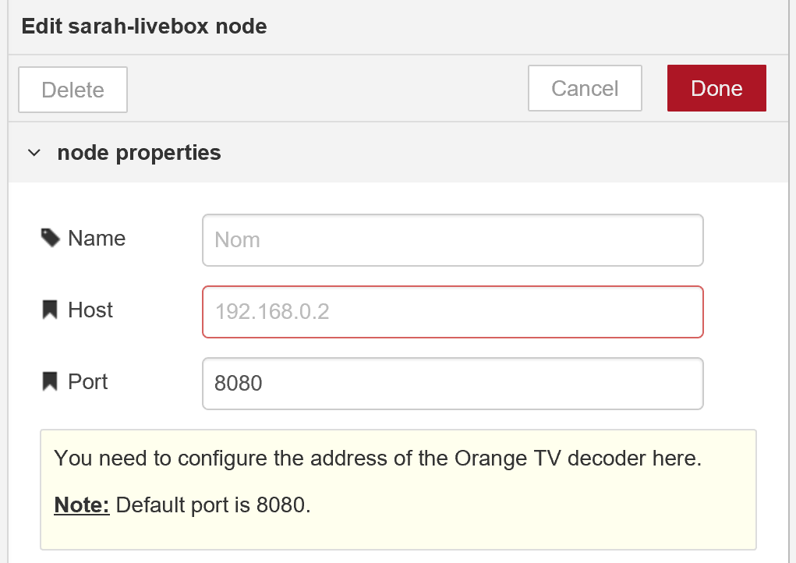

<p align="center"></p>

> ### Module (node) Node-Red permettant à **SARAH** d'émuler la télécommande du décodeur TV **Livebox**.

## ★ Installation

1. Télécharger, extraire puis copier le repertoire **sarah-livebox** dans le dossier `\sarah\viseo-bot-framework\node_modules\`.

2. Copier le fichier **./grammar/sarah-livebox.xml** dans le dossier configuré dans le module **SARAH** (win-sarah).

    Par défaut, il s'agit du répertoire: `sarah\viseo-bot-project\data\grammar`.

3. Relancez via la commande **start.bat** et actualisez l'onglet de votre explorateur.

## ★ Configuration du module 

- Double-cliquez sur  pour en ouvrir l'éditeur...

    

- Renseigner les champs :

    - <code>Host</code> : L'adresse **IP** du décodeur.
    - <code>Port</code> : Le numéro du **Port** qui est le **8080** par défaut, n'est généralement pas à changer !

## ★ Configuration des liaisons

- Reliez les nodes **SARAH** (en entrée) et **Speak** (en sortie).

    `SARAH` ➜ `sarah-livebox` ➜ `Speak`

    Comme ci-dessous :

    

## ★ Fontionnement

### Inputs

Aprés reconnaissance de la commande vocale - selon les paramétres du fichier **sarah-livebox.xml** - le module **SARAH** (win-sarah) passe l'objet ci-dessous en message à l'entrée du module.

- `msg.payload` : {JSON} **"options"**

  ##### Exemple ➜ Commande vocale `SARAH coupe le son de la box`.

    ``` json
    {
        "options":
        {
            "plugin": "livebox",
            "cmd": "Mute"
        }
    }
    ```

#### La valeur *`plugin`* est toujours présente dans le message.

- `msg.payload.options.plugin` : {string} **"livebox"**
  
  - Le module teste la valeur **livebox** pour valider la commande.
  - Nul besoin d'un module **switch** complémentaire pour rediriger vers ce plugin.
  - Valeur de `out.action.plugin` du fichier **sarah-livebox.xml**.

#### Une des valeurs *`stby`*, *`cmd`* ou *`epg`* sera présente dans le message. Selon les commandes à envoyer à la livebox nous aurons:

- `msg.payload.options.stby` : {string} **"0"** ou **"1"**

  - Teste l'état de la Livebox, allumée ou en veille.
  - Valeur de `out.action.stby` du fichier **sarah-livebox.xml**.
#### ou
- `msg.payload.options.cmd` : {string} **"commandes"**

  - Correspond à l'appui "physique" sur les touches de la télécommande (Volume, digits, prog, etc...).
  - Valeur de `out.action.cmd` du fichier **sarah-livebox.xml**.
#### ou
- `msg.payload.options.epg` : {string} **"code\_EPG\_de\_la\_chaîne"**

  - Permet d'appeler une chaîne directement grâce à son code **EPG**, sans avoir à simuler d'appuis sur la ou les touches de la télécommande.
  - Valeur de `out.action.epg` du fichier **sarah-livebox.xml**.

### Outputs

Aprés l'envoi de la requète à la Livebox, le module renvoie (en sortie) le résultat de l'action.

- `msg.payload` : {JSON} **"result"**

  ##### Exemple ➜ Commande OK.
  
  ``` json
  {
    "result":
      {
        "responseCode": "0",
        "message": "ok",
        "data": {}
      }
  }
  ```

- `msg.payload`: {JSON} **"tts"**

  ``` json
  {
    "tts": "c'est fait"
  }
  ```
    
  - Text-To-Speech destiné au module **SARAH** (win-speak), ou autre...
  - Valeur aléatoire issue du fichier **ipCmd.js**, selon les commandes envoyées.

## ★ Utilisation

  - Les commandes disponibles sont listées dans le fichier **sarah-livebox.xml**.

  - Exemples :

    ```SARAH {allumes, éteins} la {box, livebox}```

    ```SARAH mets {la, la chaine, le programme} {3, france 3}```

    ```SARAH appuie sur la touche 1 de la {box, livebox}```

    ```SARAH monte le son de la {box, livebox}```

## ★ Compatibilité

Normalement, tous les decodeurs Orange Livebox sont compatibles.

## ★ Restrictions

Le décodeur TV **Livebox V5** ne peux pas (pour l'instant) être allumé lorsqu'il est en veille profonde...

Il vous faudra donc l'allumer manuelement avant de l'utiliser...

## ★ License

Logiciel libre sous [licence MIT](https://github.com/PhilBri/SARAH-V5-Livebox/blob/master/LICENSE)